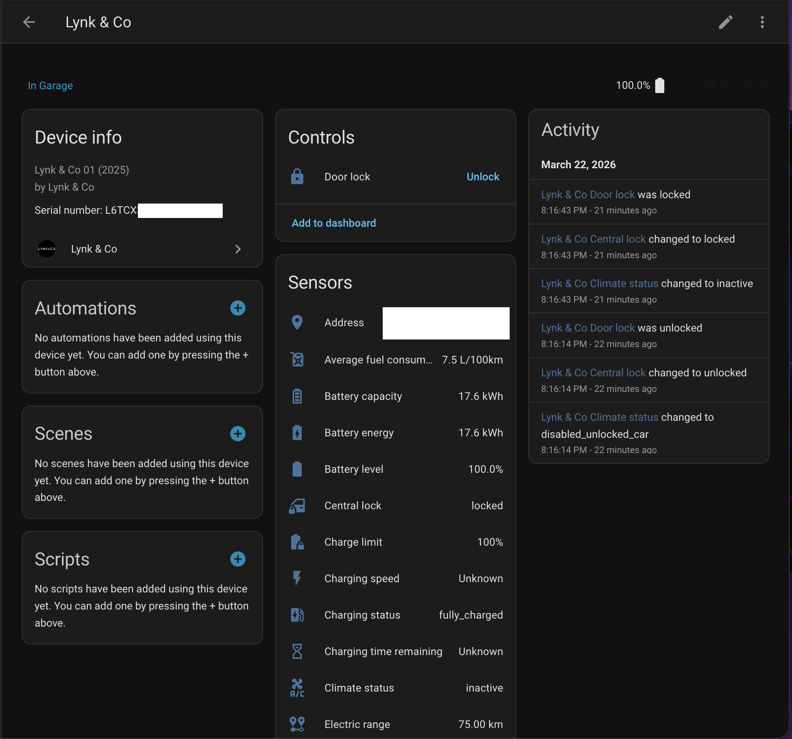

# Lynk & Co Home Assistant Integration

Custom [Home Assistant](https://www.home-assistant.io/) integration for 2025 Lynk & Co vehicles (01, 02, 08) via [HACS](https://hacs.xyz/).

Pull Requests are disabled until further notice.

## Supported Models

Tested on the following vehicles:
- 2025 (New) Lynk & Co 01 (PHEV)
- 2025 Lynk & Co 02 (BEV)
- 2025 Lynk & Co 08 (PHEV)

Other models are currently not available on the EU market, although it is likely when they do become available they are on the same platform and will work. The documentation will be updated accordingly as soon as this happens.

> **Note**: Pre-2025 Lynk & Co 01 models use a different platform and are NOT supported. You can try your luck with [this](https://github.com/Donkie/Hass-Lynk-Co) repo.

## Polling

Vehicle data is polled every 15 minutes by default. When the car is running, the polling interval automatically increases to every 60 seconds for more accurate location tracking, and reverts to 15 minutes when the car stops.

When you perform an action (e.g. lock the doors or start the heaters), only the relevant data is refreshed — not everything. The integration checks for a state change after 3 seconds, and if the car hasn't processed the command yet, retries after 5 and then 10 seconds before giving up. Fire-and-forget actions like flashing the lights or honking the horn don't trigger a refresh at all.

## ⚠️ Limitations

- Lynk&Co only allows 1 device to be logged in to the app at all times. This sadly also means that, when you log in to Home Assistant, your mobile app will automatically be logged out and vice versa. The workaround is to create a Home Assistant dashboard that replaces the Lynk&Co mobile app.

## Features

### Sensors

#### Battery
| Entity | Description | Unit | Model Availability |
|---|---|---|---|
| Battery capacity | Total battery capacity | kWh | All |
| Battery energy | Current energy in battery (capacity × SoC) | kWh | All |
| Battery level | State of charge | % | All |
| Charge limit | Configured charge limit | % | All |
| Charging speed | Current charging power | kW | All |
| Charging status | Current charging state (charging, fully_charged, etc.) | - | All |
| Charging time remaining | Time until fully charged | min | All |
| Electric range | Remaining electric range | km | All |

#### Fuel
| Entity | Description | Unit | Model Availability |
|---|---|---|---|
| Average fuel consumption | Average fuel consumption | L/100km | 01 / 08 |
| Fuel level | Remaining fuel | % | 01 / 08 |
| Fuel level (liters) | Remaining fuel in liters (capacity × percentage) | L | 01 / 08 |
| Fuel range | Remaining fuel range | km | 01 / 08 |
| Fuel type | Fuel type | - | 01 / 08 |
| Tank capacity | Fuel tank capacity | L | 01 / 08 |

#### Climate
| Entity | Description | Unit | Model Availability |
|---|---|---|---|
| Climate status | HVAC state | - | All |
| Front left seat heater | Heater status (active/inactive/disabled) | - | All |
| Front right seat heater | Heater status | - | All |
| Interior temperature | Current cabin temperature | °C | All |
| Rear center seat heater | Heater status | - | 08 More |
| Rear left seat heater | Heater status | - | 08 More |
| Rear right seat heater | Heater status | - | 08 More |
| Steering wheel heater | Heater status | - | 01 More / 02 More / 08 More |
| Target temperature | HVAC target temperature | °C | All |
| Windshield heater | Heater status | - | All |

#### Other
| Entity | Description | Unit | Model Availability |
|---|---|---|---|
| Address | Last known address | - | All |
| Central lock | Lock state (locked/unlocked) | - | All |
| Last updated | Timestamp of last API data fetch | - | All (disabled by default) |
| Last updated (climate) | Timestamp of last climate state update from vehicle | - | All (disabled by default) |
| Last updated (fuel) | Timestamp of last fuel state update from vehicle | - | 01 / 08 (disabled by default) |
| Last updated (location) | Timestamp of last location update from vehicle | - | All (disabled by default) |
| Odometer | Total distance driven | km | All |

### Binary Sensors
| Entity | Device class | Model Availability
|---|---|--|
| Front left door | door | All
| Front right door | door | All
| Rear left door | door | All
| Rear right door | door | All
| Front left window | window | All
| Front right window | window | All
| Rear left window | window | All
| Rear right window | window | All
| Sunroof | window | 01 / 08
| Hood | door | All
| Trunk | door | All
| Car running | running | All

### Device Tracker
- GPS location with coordinates

### Lock
- Door lock / unlock
- Glovebox lock (requires PIN) / unlock

### Actions (Services)

All actions (except `lynkco.refresh`) accept an optional `vin` parameter. When only one vehicle is configured, the VIN is auto-detected and can be omitted.

| Service | Description | Parameters | 01 (facelift) | 02 | 08 |
|---|---|---|---|---|---|
| `lynkco.refresh` | Force-refresh all sensors now | | ✅ | ✅ | ✅ |
| `lynkco.lock_door` | Lock the vehicle's doors | | ✅ | ✅ | ✅ |
| `lynkco.unlock_door` | Unlock the vehicle's doors | | ✅ | ✅ | ✅ |
| `lynkco.flash_lights` | Flash the vehicle's lights | | ✅ | ✅ | t.b.c. |
| `lynkco.honk_horn` | Honk the horn | | t.b.c. | ✅ | t.b.c. |
| `lynkco.open_sunroof` | Open the sunroof | | ✅ | ❌ | t.b.c.
| `lynkco.close_sunroof` | Close the sunroof | | ✅ | ❌ | t.b.c.
| `lynkco.set_charge_limit` | Set charge limit | `percent` (50-100) | ✅ | ✅ | t.b.c.
| `lynkco.start_conditioning` | Start air conditioning | `temp` (16-28) |✅ | ✅ | t.b.c.
| `lynkco.stop_conditioning` | Stop air conditioning | | ✅ | ✅ | t.b.c
| `lynkco.start_ventilate` | Open all windows slightly to ventilate | | ✅ |✅| t.b.c.
| `lynkco.stop_ventilate` | Close ventilation windows | | ✅ | ✅ |  t.b.c.
| `lynkco.start_heaters` | Start heaters | `heaters` (list) | ✅ |  t.b.c.| t.b.c. |
| `lynkco.stop_heaters` | Stop heaters | `heaters` (list) | ✅ | t.b.c. | t.b.c. |
| `lynkco.lock_glovebox` | Lock the glovebox | `pin` (4 digits) | ✅ | t.b.c. | t.b.c. |
| `lynkco.unlock_glovebox` | Unlock the glovebox | | ✅ | t.b.c. | t.b.c. |

#### Notes:
- ✅ = confirmed working on that model 
- Sunroof actions aren't available on the Lynk&Co 02 as it doesn't have a sunroof that can open. 
- A lot of the actions are only available when the doors are locked and the key is not in the vehicle.
- The gloveblox locking/unlocking appears to be only possible while the vehicle is unlocked (needs confirmation). The Lynk&Co API accepts the action when the vehicle is locked, but the glovebox doesn't appear to be locking/unlocking when it is.
- `temp` is in ºC.
- `heaters` accepts a list of zones (see table below)

#### Heater zones
**Note:** Heaters require the climate system to be active first (use `start_conditioning` before `start_heaters`).

| Zone | 01 | 02 | 08 |
|---|---|---|---|
| `front_left_seat` | ✅ | ✅ | ✅ |
| `front_right_seat` | ✅ | ✅ | ✅ |
| `rear_left_seat` | ❌ | ❌ | ✅ * |
| `rear_right_seat` | ❌ | ❌ | ✅ * |
| `steering_wheel` | ✅ * | ✅ *| ✅ * |
| `defrost` | ✅ | ✅ | ✅ |

⚠️ Zones marked with an asterisk (*) are only available on the More-models. The Core models are not equipped with these heating locations. This integration doesn't magically equip your vehicle with extra hardware :) 

### Screenshot

# Installation

## HACS (recommended)
1. Add this repository as a custom repository in HACS
2. Install "Lynk & Co"
3. Restart Home Assistant
4. Go to Settings → Integrations → Add → Lynk & Co

## Manual
Copy `custom_components/lynkco/` to your Home Assistant `custom_components` directory.

# Setup

The integration uses Azure AD B2C authentication with MFA in the same way the mobile app uses it. Setup requires a one-time browser login:

1. Add the integration in Home Assistant
2. A login URL is generated - open it in your browser
3. Open DevTools (F12) → Network tab
4. Log in with your Lynk & Co email + password + SMS MFA code
5. After MFA, the browser will fail to open `msauth://...`
6. In the network tab of your developer tools, find the last request → copy the `Location` header value (note: Firefox dev tools don't show the entire header. Right click on the request and copy the response headers instead, and then get the `msauth://` header from there)
7. Paste the full `msauth://...` URL back in Home Assistant

This process should be similar to the HACS integration for pre-2025 Lynk&Co cars such as the [Donkie](https://github.com/Donkie/Hass-Lynk-Co) one. 

Tokens are automatically refreshed. You should only need to re-authenticate if the refresh token expires (e.g. if your Home Assistant instance has been offline for an extended period of time, or when you log in on the mobile app).

# Credits

API reverse-engineered from the Lynk & Co Android app v2.55.0.

This HACS plugin is not endorsed by Lynk&Co and I have no affiliation with them whatsoever.
